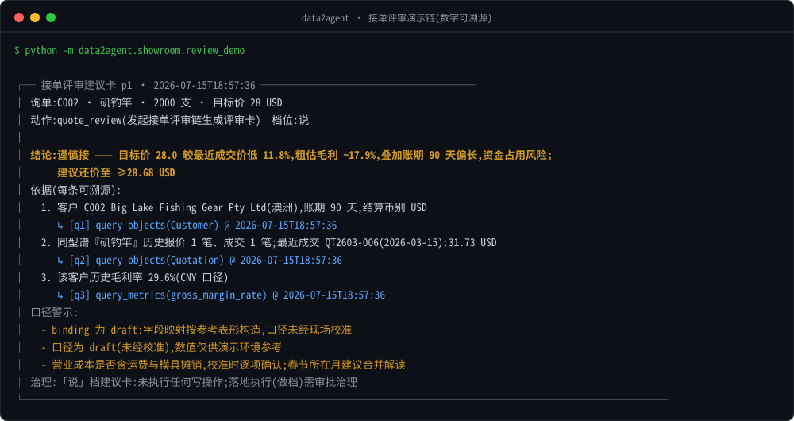

# data2agent

> **Data to Agent, for factories —— 把工厂数据接给 AI Agent。**



一句询单,Agent 查历史成交 / 毛利基线 / 账期后给出**每个数字可溯源**的接单评审建议 ——
上图由真实演示链生成(`python deploy/render_hero_svg.py` 可再生),不是手绘示意。

<!-- 演示 GIF(公开前补):brew install vhs && vhs deploy/demo.tape
     产出 docs/assets/demo.gif 后,在此嵌入:
      -->

> ⚠️ 当前处于 pre-release 私有开发阶段,首个工厂验证完成后公开。

## 这是什么

中小制造企业的数据(鼎捷 / 金蝶 / 用友 ERP、MES、SRM、CAD、Excel)大多锁在没有 API 的老系统里。
`data2agent` 正在把一条已通过模拟工厂全链路验证的方案推进到真实工厂试点,目标是把数据安全地接给任何 AI Agent:

- **抽取框架**:只读直连、ELT(原样落地 → 声明式映射)、水位 + 回看 + 分段对账、隔离区(API 轮询适配器按真实来源需求建设,当前未实现);
- **国产 ERP 连接器**:鼎捷 E10 / 易飞参考映射 + 表结构字典(持续积累于 [docs/dict](docs/dict/));
- **制造业本体模板 + 元模型**:业务对象的声明式模板(YAML,首批 5 个 / 规划 18 个),`validate` 一键校验;
- **MCP Server(lite)**:`query_objects` / `query_metrics` 只读工具 + `propose_action` 建议卡(「说」档:依据必须引用已记录查询 ID,默认脱敏、口径警示内建;主体/会话/结果摘要级证据在 v0.3 加固),任何支持 MCP 的 Agent 五分钟接入;HTTP 部署默认强制 Token + 每工具限流 + 查询审计;
- **运维 / 管理界面**:平台 `console`(`:8849`)与中间 `middle_admin`(`:8851`)为 Jinja2+HTMX
  管理页(配置白名单编辑、状态、日志、调试;浏览器首次配置);v0 内嵌运维单页保留在 `/v0`;
  独立 Vue Console(`console-ui/`)是当前产品主路线,用于日常监控与数据验证。现场推荐[便携包](docs/runbook/portable.md)
  双击 `data2agent.exe`,链路验收见 [push-validation](docs/runbook/push-validation.md);
- **数字厂长展厅**:`docker compose up` 一键起 SQL Server 模拟工厂(渔具外销厂,E10 参考表形)+ 抽取常驻 + MCP(HTTP :8848)+ 运维控制台(:8849);接单评审演示链脚本版 / Agent 版双就绪。

**安全承诺**:装进你内网、碰你数据库的每一行代码都在这个仓库里 —— 只读账号、白名单表、限时限流、错峰窗口,全部可审计,可逐行核对。

## 快速开始

```bash
pip install -e ".[dev,mcp]"
pytest tests -q                                   # 110 passed, 5 skipped(mssql 集成测试需 Docker)
python -m data2agent.metamodel.validate templates # 模板校验
python -m data2agent.showroom.seed                # 生成展厅模拟库 showroom/e10.sqlite(E10 参考表形)
python -m data2agent.connect sync --sqlite showroom/e10.sqlite   # 抽取:水位增量 → 落地库(只读/白名单/审计)
python -m data2agent.connect apply                # 映射:raw_* → 物化对象层 obj_*(隔离区 + 熔断)
python -m data2agent.connect excel-suggest --file 报价历史.xlsx --object Quotation --out map.yaml
python -m data2agent.connect excel-import  --file 报价历史.xlsx --map map.yaml   # Excel 导入(确认一次,长期记住)
python -m data2agent.mcp_server                   # MCP Server 读对象层(stdio,只读 + 默认脱敏)
python -m data2agent.showroom.review_demo         # 接单评审演示链:终端直出建议卡(离线)
python -m data2agent.console --config connect.example.yaml   # 运维控制台 http://127.0.0.1:8849

docker compose up --build   # 展厅一键版:SQL Server 模拟工厂 + 抽取常驻 + MCP(HTTP :8848)+ 运维控制台(:8849)
# 演示:docker compose exec connector python -m data2agent.showroom.review_demo --db /data/factory.sqlite
# 接入 Claude Code 试玩(本机版):
#   claude mcp add d2a-factory -- .venv/bin/python -m data2agent.mcp_server
```

## 设计文档

产品定位、架构、各组件详设见 [docs/design](docs/design/00-overview.md)(00 总览 → 01 元模型 → 02 抽取框架 → 03 MCP 网关 → 04 展厅 → 05 控制台)。

现场拆机部署:[便携包](docs/runbook/portable.md) · [推送验收](docs/runbook/push-validation.md)。

## 边界(诚实声明)

data2agent 当前是**完整可运行的 MVP / 展厅链**,已覆盖“数据到达 Agent + 接单评审”的演示和单机验证。真实工厂试点前仍需完成可观察控制台、字段级验证、跨机对账(E6b)、批次回执和生产加密传输;详见[产品开发路线图](docs/superpowers/plans/2026-07-17-product-development-roadmap.md)。口径校准、主数据对齐、“做”档审批治理和行业知识包仍属后续能力。

## 贡献与安全

- 欢迎贡献其他 ERP(金蝶 / 用友 / E10)的 binding 与表字典,见 [CONTRIBUTING](CONTRIBUTING.md);
- 安全问题请走 [SECURITY.md](SECURITY.md),勿发公开 issue;
- 小团队维护,issue 响应尽力而为(通常一周内)。

Apache-2.0 © data2agent contributors
